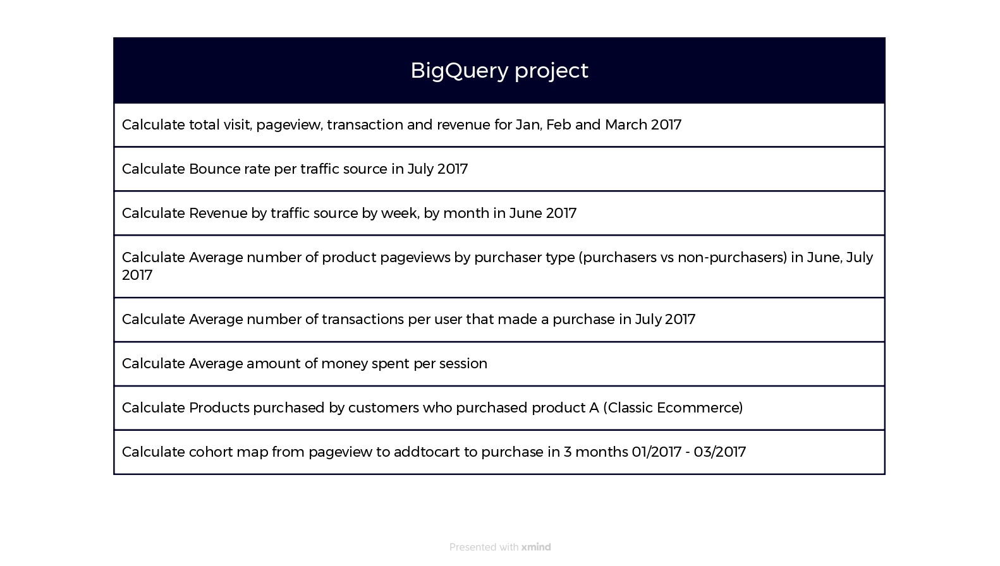

# Project Requirements
This project aims to analyze customer behavior on an e-commerce website in 2017, providing valuable insights for improving business strategies and enhancing user experience. By analyzing various data points, such as visits, pageviews, transactions, and revenue, this project sheds light on customers' interactions with the website, their purchasing patterns, and engagement levels.

### Requirement specification:

